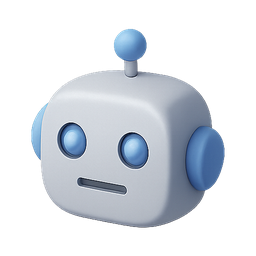

# Chatty

[](https://chatbot-v1-ly2vly8kx-lochlanns-projects.vercel.app/index.html)
[](https://nodejs.org/)
[](https://vercel.com)
[](https://ai.google.dev/)
[](LICENSE)

> **Specialized AI chatbots designed for different business needs. Experience how purpose-built chatbots work better than generic ones with 6 unique bots powered by 11 cutting-edge AI models.**


---

## Why This Project Matters

Most websites use generic chatbots that try to handle everything. But different types of businesses have different visitor needs. This project explores how **specialized chatbots** can work better than generic ones by focusing on specific business contexts and user expectations.

### Key Benefits of Specialized Bots
- **Context Understanding**: Domain-specific knowledge and responses
- **Better UX**: Users get relevant answers faster
- **Purpose-Built Design**: Interface matches the intended use case
- **Optimized Performance**: Reduced token usage with focused prompts

---

## Bot Collection

| Bot | Purpose | Key Features | Status |
|-----|---------|--------------|--------|
| **Shopping Assistant** | E-commerce focused chatbot |  Product Search,  Order Tracking,  Returns | Popular |
| **Academic Guide** | Educational institution bot |  Course Info,  Admissions,  Campus Life |  Free |
| **Quick Helper** | Lightweight modal interface |  Minimal UI,  Quick Replies,  Modal Design |  Free |
| **Adaptive Assistant** | Multi-personality bot | Multi-Mode,  Adaptable,  Versatile |  Free |
| **TravelBot** | AI travel companion |  Trip Planning,  Budget Calculator,  Local Tips |  New |
| **FixIt Pro** | DIY and home repair assistant |  DIY Guides,  Tool Tips, Safety First |  New |

---

## Features

### Core Features
- **6 Specialized Bots**: Each designed for specific use cases
- **11 AI Models**: Including Llama 4, DeepSeek R1, Gemini 2.5 Pro
- **Interactive Previews**: Hover over bot cards to see demos
- **Analytics Dashboard**: Real-time performance metrics
- **Dark/Light Themes**: Seamless theme switching
- **Mobile Optimized**: Responsive design for all devices

### Recent Enhancements
- **Sticky Navigation**: Navbar follows you as you scroll with subtle glow effects
- **Enhanced Bot Cards**: Status badges (Popular, Free, New) and interactive previews
- **Theme Switcher**: Bottom-right theme toggle with smooth transitions
- **GitHub Integration**: Easy access to source code
- **Performance Optimized**: Streamlined codebase with deprecated code removed

---

## Quick Start

### Prerequisites
- Node.js 18.x or higher
- Google Gemini API key

### Installation

1. **Clone the repository**
   ```bash
   git clone https://github.com/Lochy2000/chatbot-v1.git
   cd chatbot-v1
   ```

2. **Install dependencies**
   ```bash
   npm install
   ```

3. **Set up environment variables**
   ```bash
   # Copy the example environment file
   cp .env.example .env.local
   
   # Add your Gemini API key to .env.local
   echo "GEMINI_API_KEY=your_gemini_api_key_here" > .env.local
   ```

4. **Run locally**
   ```bash
   npm run dev
   ```
   Visit `http://localhost:8000` to see the site

### Deployment

Deploy to Vercel in 3 clicks:

1. [](https://vercel.com/new/clone?repository-url=https://github.com/Lochy2000/chatbot-v1)
2. Set `GEMINI_API_KEY` environment variable in Vercel dashboard
3. Deploy!

---

## Project Structure

```
Chatty
├── 📄 README.md                 # Project overview
├── 📄 package.json              # Dependencies and scripts
├── 📄 vercel.json              # Vercel deployment config
├── 📄 .env.example             # Environment template
│
├── 📁 documentation/            # Project documentation
│   ├── 📄 deprecated.md        # Deprecated code documentation
│   ├── 📄 ARCHITECTURE.md      # System architecture
│   ├── 📄 DEVELOPMENT.md       # Development guide
│   └── 📄 DEPLOY.md            # Deployment instructions
│
├── 📁 public/                   # Frontend files
│   ├── 📄 index.html           # Landing page
│   ├── 📄 analytics.html       # Analytics dashboard
│   ├── 📄 icon-gallery.html    # Icon showcase
│   │
│   ├── 📁 assets/              # Static resources
│   │   ├── 📁 css/             # Stylesheets
│   │   │   ├── icons.css       # Icon utilities
│   │   │   └── model-selector.css # Bot page styling
│   │   ├── 📁 js/              # JavaScript modules
│   │   │   ├── enhancements.js # Core UI enhancements
│   │   │   ├── theme-switcher.js # Theme toggle
│   │   │   ├── model-selector.js # AI model selection
│   │   │   └── deprecated/     # Archived code
│   │   └── 📁 images/          # Assets and icons
│   │       ├── bot.png         # Main logo
│   │       ├── chaticon.png    # Alternative logo
│   │       └── 📁 icons/       # 25+ 3D icons
│   │
│   └── 📁 bots/                # Individual bot pages
│       ├── ecommerce.html      # Shopping Assistant
│       ├── education.html      # Academic Guide
│       ├── minimal.html        # Quick Helper
│       ├── foundation.html     # Adaptive Assistant
│       ├── travel.html         # TravelBot
│       └── fixITbot.html       # FixIt Pro
│
├── 📁 api/                     # Backend API
│   ├── 📄 chat.js             # Main Gemini API endpoint
│   └── 📄 quote.js            # Additional functionality
│
└── 📁 node_modules/           # Dependencies
```

---

## Technology Stack

### Frontend


- **HTML5**: Semantic markup and modern structure
- **CSS3**: Glassmorphism, gradients, animations, responsive design
- **Vanilla JavaScript**: ES6+ modules, no frameworks for optimal performance

### Backend


- **Vercel Serverless Functions**: Scalable API endpoints
- **Node.js 18.x**: Modern JavaScript runtime

### AI Integration


- **11 AI Models**: Gemini 1.5 Flash/Pro, Llama 4 Scout/Maverick, DeepSeek V3/R1, and more
- **Token tracking**: Monitor usage and costs
- **Specialized prompting**: Domain-specific instructions for each bot

---

## Development

### Available Scripts

```bash
# Start development server (Python)
npm run dev

# Start development server (Node.js alternative)
npm run dev:serve

# Build project (static files ready)
npm run build

# Start production server
npm start
```

### Environment Variables

| Variable | Description | Required |
|----------|-------------|----------|
| `GEMINI_API_KEY` | Google Gemini API key | ✅ Yes |

### API Endpoints

| Endpoint | Method | Description |
|----------|--------|-------------|
| `/api/chat` | POST | Main chatbot interaction |
| `/api/quote` | GET | Additional functionality |

---

## Design Features

### Visual Elements
- **Glassmorphism Design**: Translucent UI elements with backdrop blur
- **Dynamic Gradients**: Modern, vibrant color schemes
- **Smooth Animations**: Floating orbs, ripple effects, counter animations
- **Status Badges**: Visual indicators for bot popularity and availability
- **Interactive Previews**: Hover demos for each bot

### User Experience
- **Sticky Navigation**: Fixed navbar with scroll effects and subtle glow
- **Theme Switching**: Dark/light mode toggle with smooth transitions
- **Mobile-First**: Optimized touch interactions and responsive design
- **Real-time Chat**: Instant responses with typing indicators
- **Analytics Dashboard**: Performance metrics and usage insights

### Accessibility
- **WCAG Compliant**: Proper contrast ratios and semantic HTML
- **Keyboard Navigation**: Full keyboard support with focus management
- **Screen Reader Friendly**: ARIA labels and descriptions

---

## Bot-Specific Features

### Shopping Assistant (Popular)
- **E-commerce Focus**: Product search, order tracking, returns handling
- **Shopping Theme**: Commerce-specific gradients and icons
- **Interactive Demo**: Product recommendation simulation

### Academic Guide (Free)
- **Educational Prompts**: Course info, admissions, campus life
- **Rate Limiting**: Usage controls (10 messages/session)
- **Structured Responses**: Organized with headings and bullet points

### Quick Helper (Free)
- **Minimal UI**: Modal-based, non-disruptive design
- **Fast Responses**: Optimized for quick interactions
- **Lightweight**: Minimal resource usage

### Adaptive Assistant (Free)
- **Multi-personality**: Adapts communication style
- **Versatile Responses**: Handles various conversation types
- **Dynamic Behavior**: Changes based on user interaction

### TravelBot (New)
- **Trip Planning**: Complete itinerary creation
- **Budget Calculator**: Cost estimation and breakdown
- **Local Insights**: Hidden gems and cultural tips

### FixIt Pro (New)
- **DIY Guides**: Step-by-step repair instructions
- **Tool Recommendations**: Specific tool suggestions
- **Safety First**: Comprehensive safety guidelines

---

## Performance Metrics

### Optimization Features
- **Bundle Size**: Optimized JavaScript loading
- **Load Time**: Fast initial page rendering
- **API Response**: Efficient AI model integration
- **Mobile Score**: High Lighthouse performance ratings

### Analytics Ready
- **Real-time Metrics**: Bot usage and performance tracking
- **Response Monitoring**: API response times and success rates
- **User Engagement**: Interaction patterns and conversion rates

---

## Contributing

We welcome contributions! Here's how to get started:

1. **Fork the repository**
2. **Create a feature branch**: `git checkout -b feature/amazing-bot`
3. **Make your changes**: Add new bots or improve existing ones
4. **Test thoroughly**: Ensure all functionality works correctly
5. **Update documentation**: Keep all docs current
6. **Submit a pull request**: Describe your changes clearly

### Using the Icon Collection

The project includes 25+ high-quality 3D icons:

```html
<!-- Use in HTML -->


<!-- Use in CSS -->
.icon-robot {
    background-image: url('assets/images/icons/robot.png');
}
```

**Available Icons**: robot, graduation, bluechat, database-storage, flask-lab-blue, lightbulb, security, and many more!

---

## Documentation

- [Architecture Guide](documentation/ARCHITECTURE.md) - System design and structure
- [Development Guide](documentation/DEVELOPMENT.md) - Setup and development workflow
- [Deployment Guide](documentation/DEPLOY.md) - Production deployment instructions
- [Deprecated Code](documentation/deprecated.md) - Archived code documentation

---

## Roadmap

### Completed Recently
- ✅ Analytics dashboard with real-time metrics
- ✅ Dark/light theme switching
- ✅ Enhanced bot card interactions
- ✅ Sticky navigation with scroll effects
- ✅ Mobile optimization improvements
- ✅ Code cleanup and performance optimization

### In Progress
- 🚧 Advanced bot comparison features
- 🚧 Custom bot builder interface
- 🚧 Multi-language support

### Planned Features
- 📋 Voice chat integration
- 📋 Enhanced analytics with A/B testing
- 📋 Custom theming system
- 📋 Plugin architecture
- 📋 Progressive Web App (PWA) capabilities

---

## Troubleshooting

### Common Issues

**Bot responses show "Local Development Mode"**
- Ensure you've deployed to Vercel or configured the API properly
- Check that `GEMINI_API_KEY` is set in your environment

**Icons not loading**
- Verify paths are correct: `assets/images/icons/icon-name.png`
- Check that files exist in the icons directory

**Theme switcher not visible**
- Ensure JavaScript is enabled
- Check browser console for any errors

**Navigation items cut off**
- Recent update improved spacing - refresh the page
- Check viewport width on mobile devices

---

## License

This project is licensed under the MIT License - see the [LICENSE](LICENSE) file for details.

---

## Acknowledgments

- **Google Gemini**: For providing advanced AI capabilities
- **Vercel**: For seamless deployment and hosting
- **Icon Design**: High-quality 3D icons from various creative sources
- **Community**: For feedback, contributions, and suggestions

---

## Support & Contact

- **Issues**: [GitHub Issues](https://github.com/Lochy2000/chatbot-v1/issues)
- **Discussions**: [GitHub Discussions](https://github.com/Lochy2000/chatbot-v1/discussions)
- **Repository**: [GitHub Repository](https://github.com/Lochy2000/chatbot-v1)

---

<div align="center">

**⭐ Star this repo if you found it helpful!**

[](https://github.com/Lochy2000/chatbot-v1/stargazers)

---

*Built with ❤️ for the AI community*

</div>
