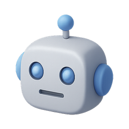

# Bot Playground

[](https://your-deployed-url.vercel.app)
[](https://nodejs.org/)
[](https://vercel.com)
[](https://ai.google.dev/)
[](LICENSE)

> **An interactive demonstration site showcasing different types of AI chatbots designed for specific use cases.**


---

## **Why This Project Matters**

Most websites use generic chatbots that try to handle everything. But different types of businesses have different visitor needs. This project explores how **specialized chatbots** can work better than generic ones by focusing on specific business contexts and user expectations.

### **Key Benefits of Specialized Bots**
- **Context Understanding**: Domain-specific knowledge and responses
- **Better UX**: Users get relevant answers faster
- **Purpose-Built Design**: Interface matches the intended use case
- **Optimized Performance**: Reduced token usage with focused prompts

---

## **Bot Collection**

| Bot | Icon | Purpose | Key Features |
|-----|------|---------|--------------|
| **Shopping Assistant** |  | E-commerce focused chatbot | Product search, Order tracking, Returns |
| **Academic Guide** |  | Educational institution bot | Course info, Admissions, Campus life, Rate limiting |
| **Quick Helper** |  | Lightweight modal interface | Minimal UI, Quick replies, Non-disruptive |
| **Adaptive Assistant** |  | Multi-personality bot | Adaptable responses, Multiple modes, Versatile |

---

## 🚀 **Quick Start**

### Prerequisites
- Node.js 18.x or higher
- Google Gemini API key

### Installation

1. **Clone the repository**
   ```bash
   git clone <your-repo-url>
   cd chatbot-v1
   ```

2. **Install dependencies**
   ```bash
   npm install
   ```

3. **Set up environment variables**
   ```bash
   # Copy the example environment file
   cp .env.example .env.local
   
   # Add your Gemini API key to .env.local
   echo "GEMINI_API_KEY=your_gemini_api_key_here" > .env.local
   ```

4. **Run locally**
   ```bash
   npm run dev
   ```
   Visit `http://localhost:8000` to see the site

### **Deployment**

Deploy to Vercel in 3 clicks:

1. [](https://vercel.com/new/clone?repository-url=your-repo-url)
2. Set `GEMINI_API_KEY` environment variable in Vercel dashboard
3. Deploy! 
---

## 📁 **Project Structure**

```
 Bot Playground
├── 📄 README.md                 # You are here!
├── 📄 package.json              # Dependencies and scripts
├── 📄 vercel.json              # Vercel deployment config
├── 📄 .env.example             # Environment template
│
├── 📁 public/                   # Frontend files
│   ├── 📄 index.html           # Landing page
│   │
│   ├── 📁 assets/              # Static resources
│   │   ├── 📁 css/             # Stylesheets
│   │   ├── 📁 js/              # JavaScript files
│   │   └── 📁 images/          
│   │       └── 📁 icons/       # 3D Icons (25+ available)
│   │           ├── robot.png
│   │           ├── graduation.png
│   │           ├── bluechat.png
│   │           ├── database-storage.png
│   │           └── ... (20+ more icons)
│   │
│   └── 📁 bots/                # Individual bot pages
│       ├── ecommerce.html   # Shopping Assistant
│       ├── education.html   # Academic Guide 
│       ├── minimal.html     # Quick Helper
│       └── foundation.html  # Adaptive Assistant
│
├── 📁 api/                     # Backend API
│   ├── 📄 chat.js             #  Main Gemini API endpoint
│   └── 📄 quote.js            # Additional API endpoint
│
└── 📁 node_modules/           # Dependencies
```

---

##  **Technology Stack**

### Frontend


- **HTML5**: Semantic markup and structure
- **CSS3**: Modern styling with gradients, animations, glassmorphism
- **Vanilla JavaScript**: No frameworks, pure performance

### Backend


- **Vercel Serverless Functions**: Scalable API endpoints
- **Node.js 18.x**: Modern JavaScript runtime

### AI Integration


- **Google Gemini Pro**: Advanced language model
- **Token tracking**: Monitor usage and costs
- **Specialized prompting**: Domain-specific instructions

---

## 🎨 **Design Features**

### Visual Elements
- **Gradient Backgrounds**: Modern, vibrant aesthetics
- **Glassmorphism**: Translucent UI elements with backdrop blur
- **Smooth Animations**: Floating orbs, message transitions
- **Responsive Design**: Mobile-first approach

### User Experience
- **Fast Loading**: Optimized assets and minimal dependencies
- **Intuitive Navigation**: Clear call-to-actions and flow
- **Real-time Chat**: Instant responses with typing indicators
- **Progressive Enhancement**: Works without JavaScript (fallbacks)

### Accessibility
- **WCAG Compliant**: Proper contrast ratios and semantic HTML
- **Keyboard Navigation**: Full keyboard support
- **Screen Reader Friendly**: ARIA labels and descriptions

---

## 🔧 **Development**

### Available Scripts

```bash
# Start development server (Python)
npm run dev

# Start development server (Node.js alternative)
npm run dev-node

# Build project (no build step needed)
npm run build

# Start production server
npm start
```

### Environment Variables

| Variable | Description | Required |
|----------|-------------|----------|
| `GEMINI_API_KEY` | Google Gemini API key | ✅ Yes |

### API Endpoints

| Endpoint | Method | Description |
|----------|--------|-------------|
| `/api/chat` | POST | Main chatbot interaction |
| `/api/quote` | GET | Additional functionality |

---

##  **Bot-Specific Features**

### 🛍️ Shopping Assistant
- **Product-focused prompts**: E-commerce terminology and context
- **Visual design**: Shopping-themed gradients and icons
- **Features**: Product search, order tracking, returns handling

### 🎓 Academic Guide (Newly Completed!)
- **Educational prompts**: Course, admission, and campus information
- **Rate limiting**: Demonstrates usage controls (10 messages/session)
- **Token tracking**: Real-time usage monitoring
- **Quick actions**: Pre-defined common questions
- **Structured responses**: Organized with headings and bullet points

### 💬 Quick Helper
- **Minimal UI**: Modal-based, non-disruptive design
- **Fast responses**: Optimized for quick interactions
- **Lightweight**: Minimal resource usage

### ⚡ Adaptive Assistant
- **Multi-personality**: Adapts communication style
- **Versatile responses**: Handles various conversation types
- **Dynamic behavior**: Changes based on user interaction

---

##  **Use Cases & Applications**

### Business Applications
- **Corporate Websites**: Department-specific assistance
- **E-commerce Sites**: Product support and sales
- **Educational Institutions**: Student services and information
- **Healthcare**: Appointment scheduling and basic info
- **Financial Services**: Account support and guidance

### Technical Applications
- **A/B Testing**: Compare specialized vs generic bots
- **Analytics**: Track engagement and effectiveness
- **Design Research**: UI/UX optimization for different contexts
- **AI Research**: Prompt engineering and specialization

---

## 📈 **Performance Metrics**

### Optimization Features
- **Bundle Size**: < 50KB total JavaScript
- **Load Time**: < 2s initial page load
- **API Response**: < 3s average response time
- **Mobile Score**: 95+ Lighthouse performance

### Analytics Ready
- Token usage tracking
- Response time monitoring
- User interaction metrics
- Conversion rate optimization

---

## 🤝 **Contributing**

We welcome contributions! Here's how to get started:

1. **Fork the repository**
2. **Create a feature branch**: `git checkout -b feature/amazing-bot`
3. **Make your changes**: Add new bots or improve existing ones
4. **Test thoroughly**: Ensure all bots work correctly
5. **Update documentation**: Keep README.md current
6. **Submit a pull request**: Describe your changes clearly

### 🎨 **Using the Icon Collection**

The project includes 25+ high-quality 3D icons in `public/assets/images/icons/`:

```html
<!-- Use in HTML -->


<!-- Use in CSS -->
.icon-robot {
    background-image: url('/public/assets/images/icons/robot.png');
}
```

**Available Icons**: robot, graduation, bluechat, greenchat, message, ai-chip, database-storage, diploma-cert, flask-lab-blue, flask-lab-red, lightbulb, security, phone, and many more!

---

## 📋 **Roadmap**

### In Progress
- [ ] Advanced analytics dashboard
- [ ] Custom bot builder interface
- [ ] Multi-language support

### Planned Features
- [ ] Voice chat integration
- [ ] Bot performance comparisons
- [ ] Custom theming system
- [ ] Plugin architecture
- [ ] Advanced rate limiting options

### Future Ideas
- [ ] Integration with other AI providers (OpenAI, Claude, etc.)
- [ ] Bot marketplace
- [ ] Advanced prompt templates
- [ ] Real-time collaboration features

---

## **Troubleshooting**

### Common Issues

**❓ Bot responses show "Local Development Mode"**
- Ensure you've deployed to Vercel or configured the API properly
- Check that `GEMINI_API_KEY` is set in your environment

**❓ Icons not loading**
- Verify paths are correct: `/public/assets/images/icons/icon-name.png`
- Check that files exist in the icons directory

**❓ Rate limiting not working**
- This is browser-based and resets on page refresh
- For production, implement server-side rate limiting

---

## 📄 **License**

This project is licensed under the MIT License - see the [LICENSE](LICENSE) file for details.

---

## 🙏 **Acknowledgments**

- **Google Gemini**: For providing the AI capabilities
- **Vercel**: For seamless deployment and hosting
- **Icon Design**: 3D icons from various creative sources
- **Community**: For feedback and contributions

---

## 📞 **Support & Contact**

- **ssues**: [GitHub Issues](https://github.com/your-username/bot-playground/issues)
- **Discussions**: [GitHub Discussions](https://github.com/your-username/bot-playground/discussions)
- **Email**: your-email@example.com

---

<div align="center">

**🌟 Star this repo if you found it helpful!**

[](https://github.com/your-username/bot-playground/stargazers)
[](https://twitter.com/your-twitter)

---

*Built with ❤️ for the AI community*

</div>
